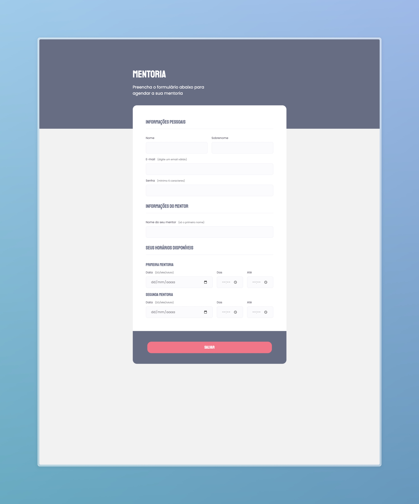

<h1 align="center">
  Formulário de Mentoria "Agende sua Mentoria"
</h1>

  
   

  <a href="#-projeto">Projeto</a>&nbsp;&nbsp;&nbsp;|&nbsp;&nbsp;&nbsp;
  <a href="#-tecnologias">Tecnologias</a>&nbsp;&nbsp;&nbsp;|&nbsp;&nbsp;&nbsp;
  <a href="#-Funcionalidades">Funcionalidades Principais</a>

 

  

## 💻 Projeto

O projeto "Agende sua Mentoria" é uma aplicação web projetada para facilitar o agendamento de sessões de mentoria. O principal objetivo é permitir que os usuários agendem uma mentoria preenchendo um formulário intuitivo. O projeto é estilizado de acordo com um layout previamente definido no Figma e utiliza HTML e CSS para criar uma experiência do usuário agradável e responsiva.

Este projeto é uma excelente demonstração de design de interface do usuário e desenvolvimento web responsivo. É adequado para qualquer pessoa que queira criar e agendaruma mentoria online de forma fácil e eficaz.

Para acessar o projeto, clique [aqui!](https://d-henrique.github.io/Formulario-mentoria/)

## 🚀 Tecnologias

Este projeto foi desenvolvido com as seguintes tecnologias:

- HTML: A linguagem de marcação padrão para criar a estrutura de páginas web.
- CSS: A linguagem de estilização usada para aprimorar a apresentação visual e o layout da página web.

## 🛠️ Funcionalidades Principais:

As principais funcionalidades do projeto "Agende sua Mentoria" incluem:

- Formulário para Informações Pessoais: Coleta nome, sobrenome, e-mail e senha do usuário.
- Formulário para Informações do Mentor: Coleta o nome do mentor (apenas o primeiro nome).
- Agenda de Disponibilidade: Fornece campos de entrada para duas sessões de mentoria, cada uma com entrada de data e horário.
- Validação: Inclui diversas validações de entrada, como campos obrigatórios, validação de formato de e-mail e validação de comprimento de senha.
- Botão de Salvar: Um botão na parte inferior da página permite que os usuários enviem o formulário para processamento.

---

 

Feito com ♥ por Doug Moreira 👋